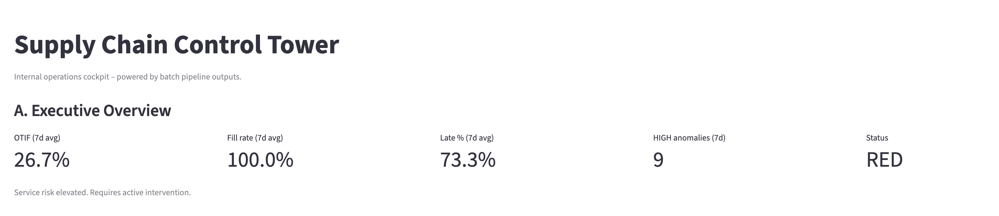
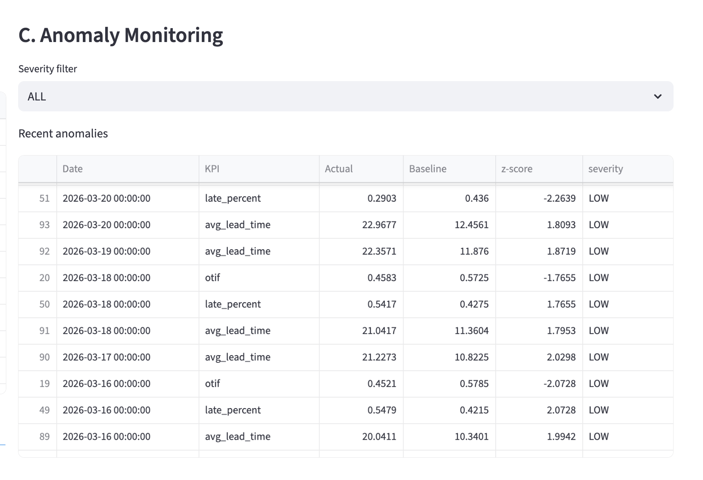
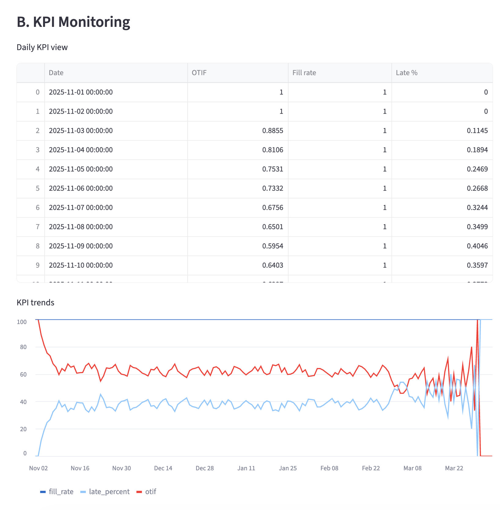

# Supply Chain Control Tower – Automation & Analytics

A lightweight, fully local control tower for supply chain operations. This project provides a repeatable batch pipeline and a Streamlit cockpit that together give operations teams a single place to monitor service performance, detect issues early, and support day‑to‑day decisions.

The focus is practical: near‑real operational visibility, simple anomaly detection, and clear recommendations that can be reviewed in minutes at the start of a shift.

---

## 1. Overview

This system turns raw order and delivery data into an operational control tower:

- **Batch pipeline** converts order‑level events into daily KPIs, anomaly signals, alerts, and a static HTML report.
- **Streamlit cockpit** acts as the internal UI for operations, consolidating the latest KPIs, anomalies, and recommendations into one place.

Everything runs locally with Python and CSV files. There are no external services, databases, or API dependencies.

---

## 2. Business Value

The control tower is designed for operations leaders, planners, and logistics coordinators who need faster feedback loops and fewer surprises in the network.

Key business outcomes:

- **Proactive operations** – identify service issues before they turn into SLA breaches.
- **Anomaly detection on KPIs** – highlight unusual behavior in OTIF, fill rate, lead times, and late deliveries.
- **Structured decision support** – consolidate recommended actions and risks into one, reviewable list.
- **Improved service reliability** – make it easier to protect promised delivery dates.
- **Operational efficiency** – focus attention on the lanes, regions, and carriers that actually need intervention.

The system is intentionally simple: deterministic batch runs, transparent CSV outputs, and a thin UI layer. This makes it easy to audit, extend, and integrate into existing internal processes.


## Case Studies (How Ops Teams Use It)

These are realistic examples of how a control-tower team would use the cockpit outputs to make decisions during daily operations.  
Numbers are **directional** and meant for decision framing, not accounting accuracy.

### Case 1 — Peak Week (Volume +20%)

**Situation:** A seasonal campaign drives a sudden volume increase.  
In practice, pressure often shows up first as a **2–3 day drift in Late %**, followed by OTIF degradation if capacity is not adjusted.

**What the control tower sees**
- KPI trend: Late % rising over several days (early warning)
- Anomalies: HIGH severity flags on Late % / Avg lead time
- Risk: missed cutoffs, sorting/dispatch bottlenecks, and lane congestion

**Typical operational actions**
- Add short-term capacity (extra departures, overtime, temporary labor)
- Tighten cutoff discipline and prioritize critical lanes / key customers
- Use expediting selectively (only where it prevents SLA breaches, not as a blanket fix)

**Decision framing (service vs cost)**
- It’s usually cheaper to buy capacity early than to react later with broad expediting.
- A small buffer on the most volatile lanes can stabilize service during the peak window.

---

### Case 2 — Carrier Reliability Drop

**Situation:** A major carrier underperforms for a week due to constraints (capacity, strikes, weather, network disruption).  
These events typically create a **localized late-delivery spike** before becoming visible at network level.

**What the control tower sees**
- KPI shift: OTIF down, Late % up, SLA violations increasing
- Anomalies: repeated HIGH severity flags tied to a region/carrier pattern
- Alerts: anomaly clusters within a short window trigger escalation

**Typical operational actions**
- Rebalance allocation away from the weakest carrier (temporary mix change)
- Protect strategic accounts with more reliable partners or targeted express options
- Start a carrier performance review with a 24–48h stabilization plan (root cause + corrective actions)

**Decision framing (service vs cost)**
- Short-term cost may increase (premium carriers / selected expediting),
  but service stability improves and prevents downstream penalties and customer churn.

---

## 3. Key Capabilities

### KPI Monitoring
- Daily KPIs for service and execution quality (OTIF, fill rate, late %, SLA violations, lead time).
- Aggregated over time to understand stability and trend.

### Anomaly Detection
- Rolling, statistics‑based anomaly detection on key KPIs.
- Flags HIGH and LOW anomalies when behavior deviates from historical norms.

### Alerts
- Operational alerts when HIGH anomalies accumulate in a short window.
- Alerts are written as JSON lines for easy downstream integration or forwarding.

### Recommendations (Placeholder‑Ready)
- Stable schema for recommended actions by region, carrier, and issue type.
- Ready to host rule‑based or model‑based recommendations.

### Scenario Planning (Directional)
- Simple directional “what‑if” levers for volume, carrier reliability, and lead time buffer.
- Helps teams reason about potential impact, without pretending to be a forecast.

### Automated Reporting
- Static HTML report summarizing recent KPI performance and anomaly activity.
- Designed to be opened directly from the cockpit or shared internally.

---

## 4. Control Tower UI

The Streamlit cockpit (`app/app.py`) exposes a single, consolidated view over all pipeline outputs.

### A. Executive Overview

- 7‑day view of OTIF, fill rate, and late percentage.
- Count of HIGH‑severity anomalies in the last week.
- **Traffic‑light status** (GREEN / YELLOW / RED) based on simple threshold rules.

This is the view operations leaders use in daily stand‑ups to understand whether the network is behaving as expected or needs immediate attention.

> 
> *Figure 1 – Executive overview of network health with KPIs and traffic‑light status.*

### B. KPI Monitoring

- Table of daily KPI values.
- Line charts for OTIF, fill rate, and late % over time.

This section supports performance reviews, weekly operations reviews, and investigations into whether recent initiatives are improving stability.

> 
> *Figure 2 – KPI trend and anomaly monitoring for proactive service management.*

### C. Anomaly Monitoring

- List of detected anomalies with date, KPI, actual value, baseline, and z‑score.
- Severity filter (ALL / LOW / HIGH).

Control tower analysts use this to focus on the periods and KPIs that behave differently from historical norms, instead of manually scanning all time series.

### D. Decision Support

- Table of recommended actions with priority, region, carrier, issue type, and suggested intervention.
- Filters on region, carrier, and priority.

This is where planners and coordinators see a short list of actions that are worth considering for today’s shift.

### E. Scenario Planning

- Baseline view of recent OTIF, fill rate, and late %.
- Sliders for volume change, carrier reliability, and lead time buffer.
- Directional scenario metrics with deltas vs baseline.

This is used in planning and review sessions to reason about potential impact of operational changes (e.g., adding buffer days or adjusting carrier mix).

> 
> *Figure 3 – Directional scenario view to reason about volume, reliability, and buffer trade‑offs.*

### F. Alerts & Reporting

- Table of recent alerts from `outputs/alerts.log`.
- Link to open the latest static HTML report.

This section gives teams a simple way to review what triggered alerts recently and to access a printable summary.

---

## 5. Architecture

At a high level, the system follows a straightforward batch pattern:

```text
Raw Orders → Ingest → Validate → Transform → KPI → Anomaly → Alerts/Report → Dashboard
```

### Pipeline Flow

1. **Ingest**  
   - Load synthetic or stored order‑level data.
   - Ensure required columns such as order dates, promised dates, actual delivery dates, quantities, carrier, region, and status.

2. **Validate**  
   - Schema checks (required columns present).
   - Business rule checks (negative quantities, shipment > ordered, promised after actual, invalid statuses).
   - Data quality summary with missing‑value thresholds, written to JSON.

3. **Transform**  
   - Add derived fields: delivery flags, lead time in days, delay days, on‑time/late flags, SLA violation indicators.

4. **KPI**  
   - Compute daily KPIs from the transformed data.
   - Generate carrier‑level and region‑level performance metrics.

5. **Anomaly Detection**  
   - Apply rolling, statistics‑based detection on daily KPI time series.
   - Classify anomalies by severity.

6. **Alerts & Recommendations**  
   - Raise alerts when anomaly load crosses configured thresholds.
   - Produce a recommendations file (schema in place; logic can be plugged in).

7. **Reporting & Dashboard**  
   - Generate a static HTML report summarizing recent performance.
   - Feed the Streamlit cockpit from CSV outputs in `outputs/`.

Everything is orchestrated by `src/pipeline.py` and configured with YAML.

---

## 6. Tech Stack

- **Language**: Python 3
- **Data processing**: pandas, numpy
- **Configuration**: YAML
- **UI**: Streamlit (pure Python, browser‑based)
- **Reporting**: HTML reports + CSV outputs
- **Anomaly logic**: simple rolling statistics based on historical KPI distributions

The project is intentionally lightweight and self‑contained, making it suitable for demos, internal prototypes, or as a building block inside a larger analytics platform.

---

## 7. How to Run

### 1. Clone and set up environment

```bash
cd supply-chain-automation-analytics
python3 -m venv .venv
source .venv/bin/activate          # on macOS/Linux
# .venv\Scripts\activate          # on Windows

pip install --upgrade pip
pip install -r requirements.txt
```

### 2. Run the batch pipeline

From the project root:

```bash
make run
# or
python3 -m src.pipeline --config configs/dev.yaml
```

This will:

- Generate synthetic order data (if not already present).
- Run validation, transformation, KPI computation, anomaly detection, and alerts.
- Produce:
  - `outputs/kpi_daily.csv`
  - `outputs/anomalies.csv`
  - `outputs/recommendations.csv`
  - `outputs/report_latest.html`
  - `outputs/alerts.log`
  - `outputs/run_metadata.json`
  - `outputs/bi/*.csv`

### 3. Launch the control tower UI

```bash
make app
# or
streamlit run app/app.py
```

Then open the URL shown in the terminal (typically http://localhost:8501).

The UI reads from `outputs/` only. If you see empty sections, run the batch pipeline first.

---

## 8. Project Structure

```text
supply-chain-automation-analytics/
├── app/
│   └── app.py                  # Streamlit control tower cockpit (read‑only UI)
├── configs/
│   └── dev.yaml                # Pipeline configuration (paths, thresholds, options)
├── data/
│   └── raw/
│       └── orders_synthetic.csv# Generated synthetic order data
├── outputs/
│   ├── bi/                     # BI‑ready CSV exports (KPI, anomalies, risk placeholder)
│   ├── dashboards/
│   │   └── bi_integration.md   # Notes on BI integration
│   ├── logs/
│   │   └── pipeline.log        # Pipeline run logs
│   ├── alerts.log              # JSONL alerts
│   ├── anomalies.csv           # Detected KPI anomalies
│   ├── data_quality_summary.json
│   ├── kpi_daily.csv           # Daily KPI time series
│   ├── recommendations.csv     # Placeholder for recommended actions
│   ├── report_latest.html      # Static HTML report
│   ├── risk_predictions.csv    # Placeholder for risk outputs
│   └── run_metadata.json       # Metadata about the last pipeline run
├── screenshots/
│   ├── dashboard.png           # Dashboard/E2E control tower preview
│   ├── anomalies.png           # KPI + anomaly monitoring preview
│   └── scenario.png            # Scenario planning preview
├── src/
│   ├── __init__.py
│   ├── actions.py              # (Placeholder‑ready) action recommendation scaffolding
│   ├── ingest.py               # Synthetic data generation and load
│   ├── kpi.py                  # KPI computations (daily, carrier, region)
│   ├── pipeline.py             # Orchestrates the full batch pipeline
│   ├── report.py               # HTML reporting utilities
│   ├── scenario.py             # Scenario utilities and helpers (if extended)
│   ├── transform.py            # Derived fields and feature engineering
│   └── validate.py             # Schema and business rule validation, data quality summary
├── Makefile                    # make run / make app
├── README.md                   # This file
└── requirements.txt            # Python dependencies
```

---

## 9. Future Improvements

The project is intentionally kept compact and local, but the following extensions are natural next steps:

- **Richer recommendation logic** – plug in rules or models to populate `recommendations.csv` with concrete, prioritized actions.
- **Carrier / lane scorecards** – add drill‑down views for specific carriers, regions, or lanes.
- **User access and auditing** – connect to identity systems and log which actions were taken.
- **Scheduling and automation** – run the pipeline on a schedule (e.g., nightly) and push alerts to messaging tools.
- **Integration with upstream systems** – replace the synthetic data generator with real order feeds.

All of these can be built on top of the existing pipeline and UI shell without changing the core structure.

---

## 10. Author

This project was built as a portfolio‑grade example of an internal supply chain control tower, focusing on:

- practical automation,
- decision support for operations teams,
- transparent and auditable analytics pipelines.
